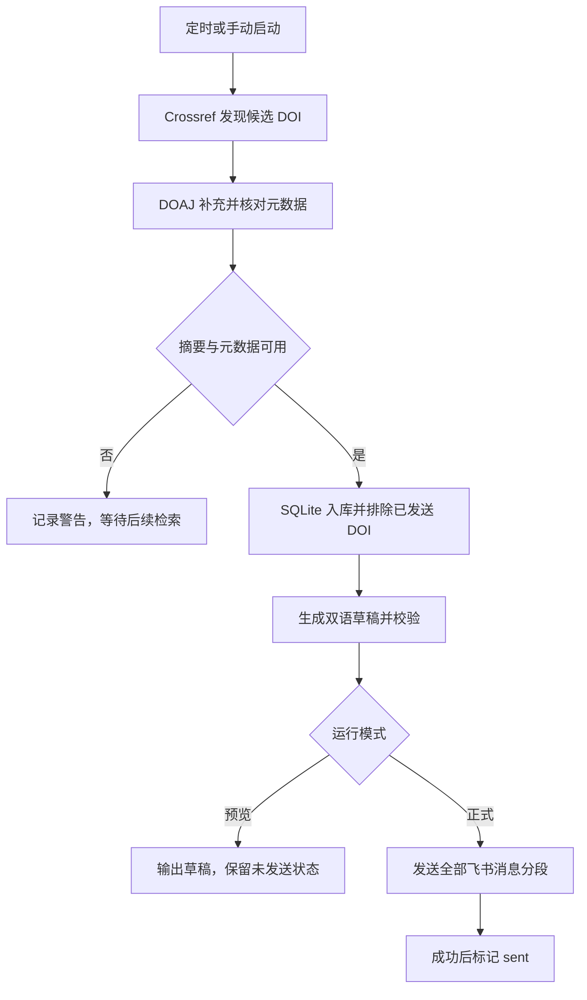

[README.md](https://github.com/user-attachments/files/31519813/README.md)
# GSIS Latest Article Digest

面向 **Geo-spatial Information Science（GSIS）** 的论文监测工具：从 Crossref 发现近期文章，以 DOAJ 补充摘要和作者关键词，按 DOI 去重，调用模型生成中英文 LinkedIn 草稿，并推送到飞书群机器人。

仓库：[ChunyaoWu0125/gsis-latest-article-digest](https://github.com/ChunyaoWu0125/gsis-latest-article-digest)

> 本文依据上传的仓库源码快照编写，`pyproject.toml` 版本为 **0.2.1**。当前程序是 GSIS 期刊双语摘要工具，后续可拓展为通用科研晨报。
>

## 目录

- [1. 功能与边界](#1-功能与边界)
- [2. 工作流程](#2-工作流程)
- [3. 环境准备与安装](#3-环境准备与安装)
- [4. 配置模型与环境变量](#4-配置模型与环境变量)
- [5. 连接飞书机器人](#5-连接飞书机器人)
- [6. 首次运行与日常使用](#6-首次运行与日常使用)
- [7. 每周一周五自动运行](#7-每周一周五自动运行)
- [8. 作为 Codex Skill 使用](#8-作为-codex-skill-使用)
- [9. 数据库日期与去重](#9-数据库日期与去重)

## 1. 功能与边界

### 已有功能

| 功能 | 当前实现 |
| --- | --- |
| 论文发现 | 查询 GSIS 的 Crossref 期刊接口，按在线发表日期回溯 |
| 双语草稿 | 英文与中文各一段，要求事实一致、每种语言含 4–6 个内嵌 hashtag |
| 飞书推送 | 群自定义机器人文本消息，可选签名校验、长消息分段 |
| 定时运行 | 提供 Windows 每周一、周五的任务注册脚本 |
| Skill | 提供 `SKILL.md`、`agents/openai.yaml` 和配套程序 |


## 2. 工作流程



分工如下：Python 程序执行检索、生成和发送；SQLite 记录状态；模型负责草稿与审核；`SKILL.md` 规定 Agent 如何安全地使用程序；操作系统定时任务负责在指定时间启动程序。

## 3. 环境准备与安装

### 3.1 需要准备

| 项目 | 要求 |
| --- | --- |
| Python | 代码声明支持 3.10 及以上；初次部署可使用 3.11 或 3.12 |
| Git | 用于克隆和更新；也可以下载 ZIP 后解压 |
| 网络 | 能访问 Crossref、DOAJ、所选模型服务；正式推送还需访问飞书 |
| 模型接口 | 支持 OpenAI SDK 所用的 Responses API 和结构化输出 |
| 飞书 | 一个允许添加自定义机器人的群，以及对应 Webhook |

没有 Node.js、Go、LangChain 或 GPU 的安装要求。若用 Codex 调用 Skill，再单独准备可运行本地命令的 Codex 环境。

以下命令都在项目根目录执行，即能看到 `SKILL.md`、`pyproject.toml`、`src/` 的目录。

### 3.2 获取代码

```powershell
git clone https://github.com/ChunyaoWu0125/gsis-latest-article-digest.git
cd gsis-latest-article-digest
```

### 3.3 Windows：标准 venv

适用于已安装 Python 3.11 和 Windows Python Launcher 的情况：

```powershell
py -3.11 -m venv .venv
$Python = (Resolve-Path .\.venv\Scripts\python.exe).Path
& $Python -m pip install -e ".[test]"
& $Python -m pytest
```

若 `py` 不存在，但 `python --version` 已确认是合适版本，可将第一行改为：

```powershell
python -m venv .venv
```

### 3.4 Windows：Conda 替代方案

如果日常使用 Anaconda，可在 Anaconda PowerShell Prompt 中执行：

```powershell
conda create --prefix .venv python=3.11 pip -y
$Python = (Resolve-Path .\.venv\python.exe).Path
& $Python -m pip install -e ".[test]"
& $Python -m pytest
```

### 3.5 Linux / macOS

```bash
python3 -m venv .venv
.venv/bin/python -m pip install -e '.[test]'
.venv/bin/python -m pytest
```

后文的 Windows 命令 `& $Python -m ...`，在这里替换为 `.venv/bin/python -m ...`。

## 4. 配置模型与环境变量

### 4.1 创建 `.env`

Windows：

```powershell
if (-not (Test-Path .env)) { Copy-Item .env.example .env }
notepad .env
```

Linux / macOS：

```bash
test -f .env || cp .env.example .env
chmod 600 .env
```

### 4.2 选择模型服务

**使用 OpenAI 官方 API 时：**

```dotenv
OPENAI_API_KEY=官方API密钥
OPENAI_BASE_URL=https://xxx
OPENAI_MODEL=gpt-xxx
```


**使用其他 OpenAI 兼容服务时：**

```dotenv
OPENAI_API_KEY=API密钥
OPENAI_BASE_URL=https://xxx
OPENAI_MODEL=gpt-xxx
```

### 4.3 首次试运行建议值

以下是便于控制排错成本的建议，不是源码默认值：

```dotenv
OPENAI_ENABLE_REVIEW=true
OPENAI_MAX_GENERATION_ATTEMPTS=1

GSIS_LOOKBACK_DAYS=30
GSIS_MAX_ARTICLES_PER_RUN=3
GSIS_REQUEST_TIMEOUT=30

GSIS_DB_PATH=data/gsis.db
GSIS_LOG_DIR=logs

FEISHU_WEBHOOK=
FEISHU_SECRET=
FEISHU_MAX_MESSAGE_CHARS=2000
```

### 4.4 完整配置表

| 变量 | 源码默认值 | 作用与注意事项 |
| --- | --- | --- |
| `OPENAI_API_KEY` | 空 | 正常检索流程启动时必填；`--test-feishu` 不要求 |
| `OPENAI_MODEL` | `gpt-5.6` | 生成与审核使用同一模型 |
| `OPENAI_BASE_URL` | 未设置，使用 SDK 默认地址 | 自定义地址必须为可信 HTTPS；留空时还要留意进程环境和 SDK 默认行为 |
| `OPENAI_ENABLE_REVIEW` | `true` | 开启一次额外的模型事实审核 |
| `OPENAI_MAX_GENERATION_ATTEMPTS` | `3` | 格式/事实校验不通过时的生成尝试上限，最低 1；不等同于 SDK 网络重试次数 |
| `GSIS_CROSSREF_URL` | `https://api.crossref.org/journals/1009-5020/works` | GSIS 候选论文与日期来源 |
| `GSIS_DOAJ_URL` | `https://doaj.org/api/search/articles` | 摘要和作者关键词补充来源 |
| `GSIS_DOAJ_ISSN` | `1993-5153` | DOAJ 期刊筛选值 |
| `GSIS_LOOKBACK_DAYS` | `14` | 每次回溯天数，最低 1；另受源码固定起始日期限制 |
| `GSIS_REQUEST_TIMEOUT` | `30` | Crossref、DOAJ、飞书请求超时秒数，最低 5；**不控制 OpenAI 请求** |
| `GSIS_MAX_ARTICLES_PER_RUN` | `20` | 每次最多尝试生成的文章数，最低 1 |
| `GSIS_USER_AGENT` | `GSIS-Notifier/0.2.1 (personal academic monitor)` | 检索请求标识；模板可填联系邮箱，注意这会发送给数据源 |
| `GSIS_DB_PATH` | `data/gsis.db` | SQLite 路径，相对路径按项目根目录解析 |
| `GSIS_LOG_DIR` | `logs` | 日志目录，相对路径按项目根目录解析 |
| `FEISHU_WEBHOOK` | 空 | 飞书群机器人 Webhook；作为秘密保存 |
| `FEISHU_SECRET` | 空 | 开启飞书签名校验时填写对应签名密钥 |
| `FEISHU_MAX_MESSAGE_CHARS` | `15000` | 消息字符切分阈值，最低 1000；当前不是 JSON 请求字节上限 |


## 5. 连接飞书机器人

### 5.1 选择正确的接入方式

本项目使用 **群自定义机器人 Webhook**，不是企业自建应用，更加方便。

自定义机器人通常可以直接在允许的群中添加。[飞书自定义机器人说明](https://open.feishu.cn/document/client-docs/bot-v3/add-custom-bot)

### 5.2 创建机器人并获取 Webhook

在飞书客户端中进入希望接收论文的群，打开群设置，找到 **群机器人 → 添加机器人 → 自定义机器人**，填写名称，例如 `GSIS 论文助手`，完成添加后复制 Webhook 到本地 `.env`。

```dotenv
FEISHU_WEBHOOK=在本地粘贴完整的https地址
```

### 5.3 开启签名校验

在机器人的安全设置中开启 **签名校验**，将显示的签名密钥填写到：

```dotenv
FEISHU_SECRET=在本地粘贴签名密钥
```

程序会自动生成时间戳和 HMAC 签名，不需要手工计算。请保持电脑时间准确；机器人端的签名设置与 `.env` 必须一致。[飞书签名校验说明](https://open.feishu.cn/document/client-docs/bot-v3/add-custom-bot)

### 5.4 单独测试飞书

先重新确认 `$Python` 指向项目环境，再执行：

```powershell
& $Python -m gsis_notifier --test-feishu
```

这个命令会向配置的群发送一条测试消息，**不检索论文、不调用模型、不更新论文的发送状态**。设置加载仍可能创建数据/日志目录。

预期终端输出：

```text
Feishu test message accepted.
```

群内应看到：

```text
✅ GSIS Notifier 飞书连接测试成功。
```

请以实际收到消息为最终确认。当前 `FeishuClient` 对缺失成功码的 JSON 响应校验不够严格，该项已列入修复计划。

## 6. 首次运行与日常使用

### 6.1 先执行离线测试

```powershell
& $Python -m pytest
```

现有测试使用模拟对象，不需要真实 API Key 或飞书凭据。上传快照的 **17 项测试**在 Python 3.12.13 的隔离网络检查中通过；其他 Python 版本、Windows 计划任务和真实服务连通性不在该验证范围内。

### 6.2 只预览一篇

确认 HTTPS 和模型配置后：

```powershell
& $Python -m gsis_notifier --dry-run --limit 1
```

这会检索、记录可用论文、生成草稿并输出，但不会发送飞书，也不会将 DOI 标记为 `sent`。

**当前不会复用已生成草稿。** 同一篇预览后再正式运行，仍可能再次调用模型、重新生成。不要用大量重复 dry-run 代替离线测试。

### 6.3 正式推送

确认预览内容和飞书目标群后：

```powershell
& $Python -m gsis_notifier --limit 1
```

确认正常后，可提高单次数量：

```powershell
& $Python -m gsis_notifier --limit 3
```

`--limit` 还受到 `GSIS_MAX_ARTICLES_PER_RUN` 限制。例如配置上限为 3，即使传 `--limit 10`，实际最多尝试 3 篇。只使用正整数；当前对 0 和负值没有可靠的参数拒绝逻辑。

### 6.4 命令行参数

| 参数 | 效果 |
| --- | --- |
| 无参数 | 检索、生成并正式发送，要求模型 Key 和飞书 Webhook |
| `--dry-run` | 不发送，但仍可调用模型、修改本地状态 |
| `--limit N` | 限制本次待生成文章数量，不限制检索接口返回数量 |
| `--test-feishu` | 只发连接测试消息；与其他模式混用时，代码优先走测试分支 |
| `--project-root PATH` | 指定含 `SKILL.md`、`.env` 的项目目录 |
| `--verbose` | 开启 DEBUG 日志；可能包含敏感地址，不宜常开或公开上传日志 |
| `--help` | 显示帮助，不执行工作流 |

如果从其他目录执行：

```powershell
& "C:\Projects\gsis-latest-article-digest\.venv\Scripts\python.exe" `
    -m gsis_notifier `
    --project-root "C:\Projects\gsis-latest-article-digest" `
    --dry-run --limit 1
```

把路径换成实际项目路径；Conda 环境的 Python 位于 `.venv\python.exe`。

### 6.5 Token 与费用

检索、SQLite 去重、飞书发送本身不调用语言模型。没有需要生成的文章时不会请求模型，但当前 CLI 仍要求配置非空 Key。

在一次正常成功的生成中：关闭审核通常调用模型一次；开启审核通常调用两次。校验重试、SDK 网络重试会增加耗时与请求次数。程序会在服务返回 usage 时记录输入、输出和总 token 数。

## 7. 自动运行

### 7.1 Windows 注册任务

先完成一次人工检查和正式推送，再执行：

```powershell
powershell -ExecutionPolicy Bypass -File .\scripts\install_windows_task.ps1 -Time "08:00"
```

脚本只在本次 PowerShell 启动中指定执行策略，不会永久降低系统策略；组织策略禁止执行时不要绕过管理要求。

默认任务名为 `GSIS Latest Article Digest`，每周一、周五 **Windows 本机时间 08:00** 运行。它优先查找 `.venv\python.exe`，再查找 `.venv\Scripts\python.exe`，直接启动 Python。

注意：注册脚本使用 `-Force`，会替换同名任务。需要保留旧任务时改用新的 `-TaskName`；不要同时保留多个针对同一数据库的正式推送任务。

### 7.2 查看与控制

```powershell
Get-ScheduledTask -TaskName "GSIS Latest Article Digest"

Get-ScheduledTaskInfo -TaskName "GSIS Latest Article Digest" |
    Format-List LastRunTime, LastTaskResult, NextRunTime
```

检查实际配置的 Python 和工作目录：

```powershell
(Get-ScheduledTask -TaskName "GSIS Latest Article Digest").Actions |
    Format-List Execute, Arguments, WorkingDirectory

(Get-ScheduledTask -TaskName "GSIS Latest Article Digest").Principal |
    Format-List UserId, LogonType, RunLevel
```

立即运行一次会产生正式推送：

```powershell
Start-ScheduledTask -TaskName "GSIS Latest Article Digest"
```

暂停当前任务并禁用后续触发：

```powershell
Stop-ScheduledTask -TaskName "GSIS Latest Article Digest"
Disable-ScheduledTask -TaskName "GSIS Latest Article Digest"
```

恢复后续自动触发：

```powershell
Enable-ScheduledTask -TaskName "GSIS Latest Article Digest"
```

`Ready` 表示等待运行。`LastTaskResult=0` 通常表示进程成功退出，但当前部分论文失败时程序仍可能返回 0；还要检查日志中 `failed=` 的数量。

### 7.3 自动运行条件

- 电脑不能完全关机，且必须能联网。
- 项目目录、`.venv`、`.env` 和数据库位置不能失效。

### 7.4 Linux / macOS 定时

可以在确认命令成功后，通过用户 crontab 添加一条任务。以下示例使用服务器本地时间，路径只是示例：

```cron
0 8 * * 1,5 cd /home/yourname/gsis-latest-article-digest && /home/yourname/gsis-latest-article-digest/.venv/bin/python -m gsis_notifier --project-root /home/yourname/gsis-latest-article-digest
```

这不是仓库自带的自动安装功能；需要你在自己的系统中配置。不要同时启用 Windows 与服务器两套发送端，除非已设计共享状态和防重策略。

## 8. 作为 Codex Skill 使用

### 8.1 直接在已有项目中使用

在能够访问本地项目的 Codex 中打开项目，明确请求：

```text
请读取当前项目根目录的 SKILL.md，使用本项目虚拟环境，
执行 python -m gsis_notifier --dry-run --limit 1。
不要读取或展示密钥值，不要发送飞书，不要注册定时任务。
```

### 8.2 注册到本地 Codex 的 Skill 目录

Codex 官方支持从用户级 `~/.agents/skills` 加载技能，也支持链接到技能目录。在 CLI/IDE 中可通过 `/skills` 或 `$` 选择已发现的技能；ChatGPT 的界面入口可能使用 `@`。[官方 Skill 使用说明](https://learn.chatgpt.com/docs/build-skills)

Windows 可在项目根目录建立目录联接，以复用现有程序和数据库，不复制秘密配置：

```powershell
$ProjectRoot = (Resolve-Path .).Path
$SkillsDir = Join-Path $HOME ".agents\skills"
$SkillLink = Join-Path $SkillsDir "gsis-latest-article-digest"

New-Item -ItemType Directory -Path $SkillsDir -Force | Out-Null
if (Test-Path $SkillLink) { throw "同名 Skill 路径已存在，请先确认内容，不要覆盖。" }
New-Item -ItemType Junction -Path $SkillLink -Target $ProjectRoot
```

Linux / macOS，在项目根目录执行：

```bash
mkdir -p "$HOME/.agents/skills"
ln -s "$(pwd)" "$HOME/.agents/skills/gsis-latest-article-digest"
```

已有同名目录时先检查，不要强制覆盖。链接目标移动后需要修复链接。Windows 与 Linux/WSL 是不同环境：在 WSL 中运行 Codex，就需要相应的 WSL 环境和路径。

新技能没有出现时，重新打开 Codex 会话并查看技能列表。以上为官方目录机制下的配置步骤，本次未在你的 Windows 设备上实测注册。

## 9. 数据库日期与去重

### 9.1 当前日期规则

`pipeline.py` 目前写有：

```python
INITIAL_CUTOFF_DATE = date(2026, 8, 15)
```

每次 Crossref 查询起点为：

```text
max(2026-08-15, 当前 UTC 日期 - GSIS_LOOKBACK_DAYS)
```

它不是“永远扫描自 8 月 15 日起的全部历史”；随着时间推移，只查询移动回溯窗口。对于其他使用者，固定日期属于待配置化的个人部署值。

**已知限制：**这个限制目前只约束新检索的起点，`load_unsent()` 读出的旧数据库待发送文章没有再次经过起始日期筛选。如果旧库中有更早的未发送记录，仍可能处理。不能把现有实现描述为“数据库绝不会含 8 月 15 日以前的文章”。

需要首次建立新基线时，可在明确接受“不继承旧库去重记录”的前提下改用新数据库文件；保留旧库备份，不要直接删除。已有正常部署应优先保留现有状态。

### 9.2 状态含义

| 状态 | 含义 | 下次会怎样 |
| --- | --- | --- |
| `discovered` | 元数据已入库，还未生成成功 | 仍可进入待处理队列 |
| `generated` | 已生成，但未被确认全部发送成功 | 仍可被重新生成与发送 |
| `failed` | 生成或校验失败 | 后续再次运行可以重试 |
| `sent` | 本批消息全部发送后已写入成功状态 | 默认不再生成和发送 |

没有完整摘要的候选当前只记录警告，不一定写入数据库；它们依赖后续重新检索，因此可能因收录延迟或移出窗口而遗漏。

当一篇失败、其他文章成功时，程序可以发送成功的部分。所有待处理文章都生成失败时，会退出报错，不发送“没有新论文”。
